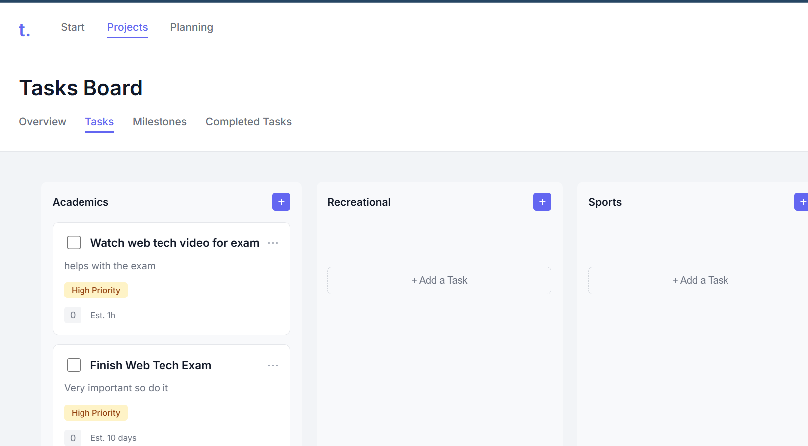
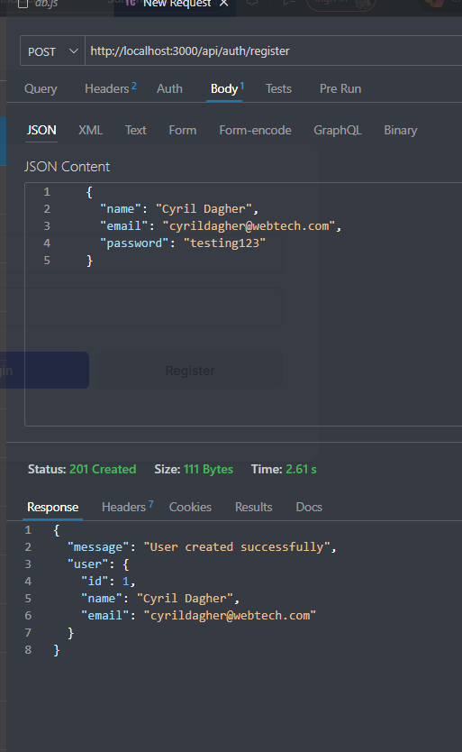
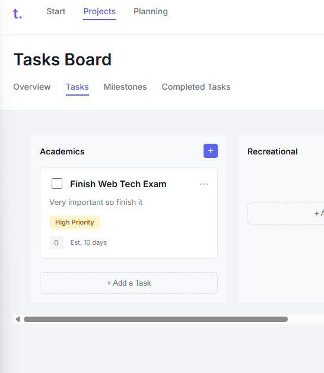
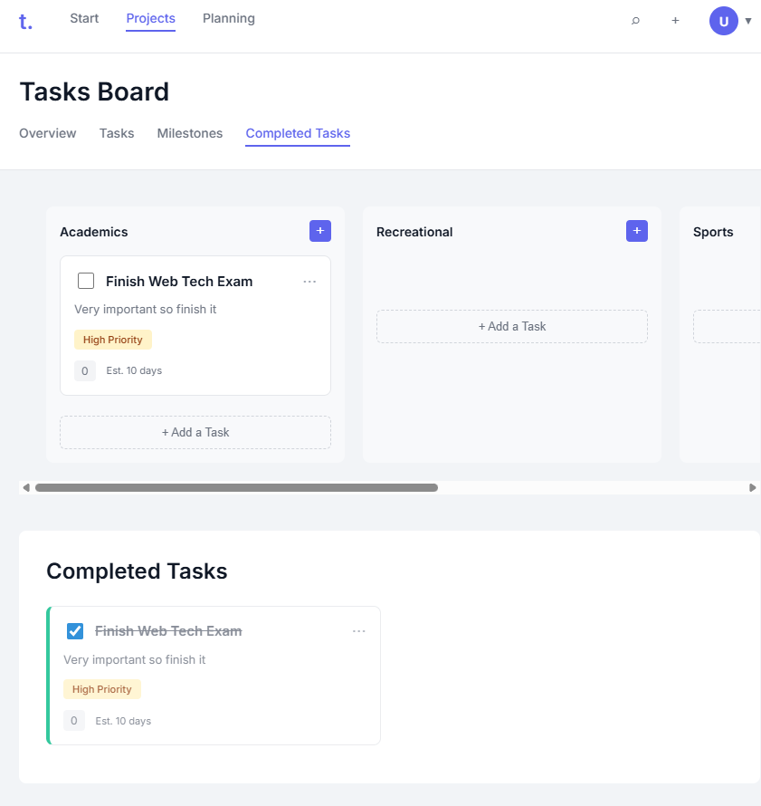
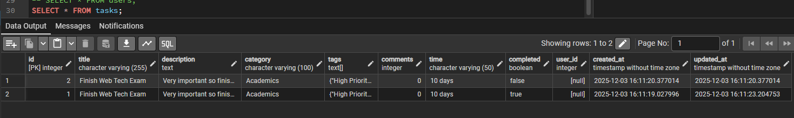
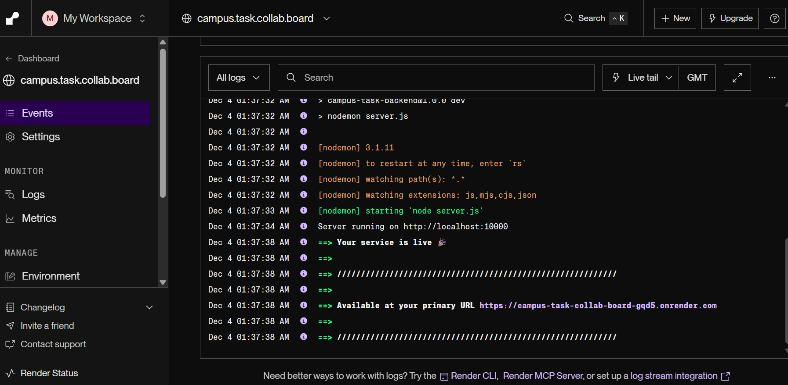
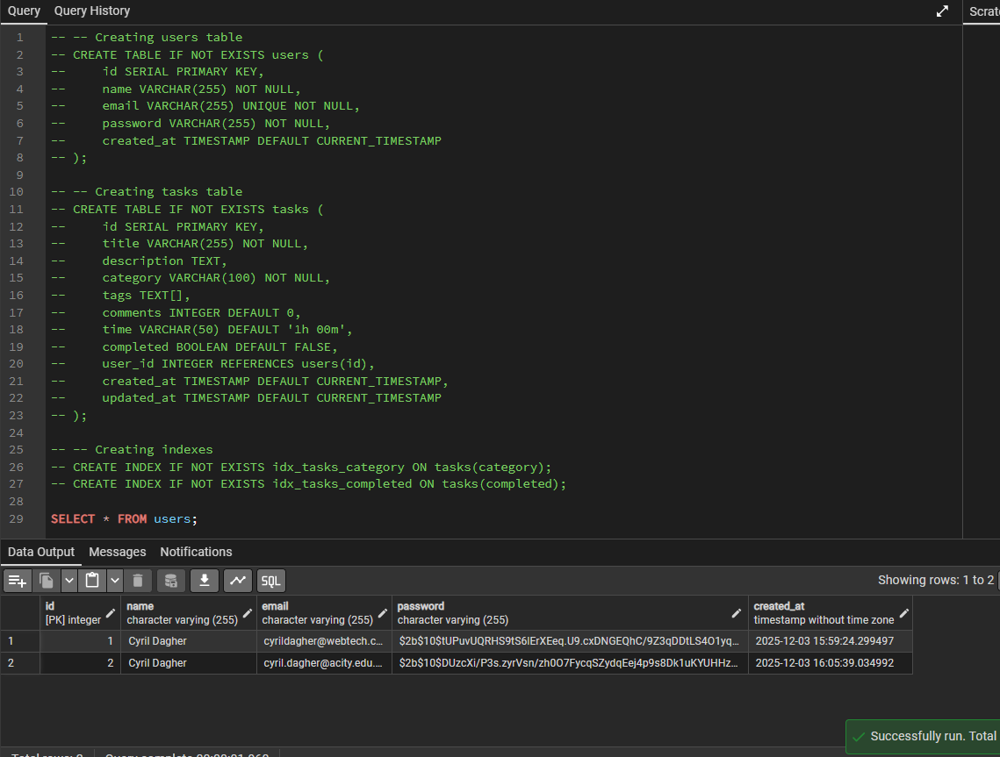
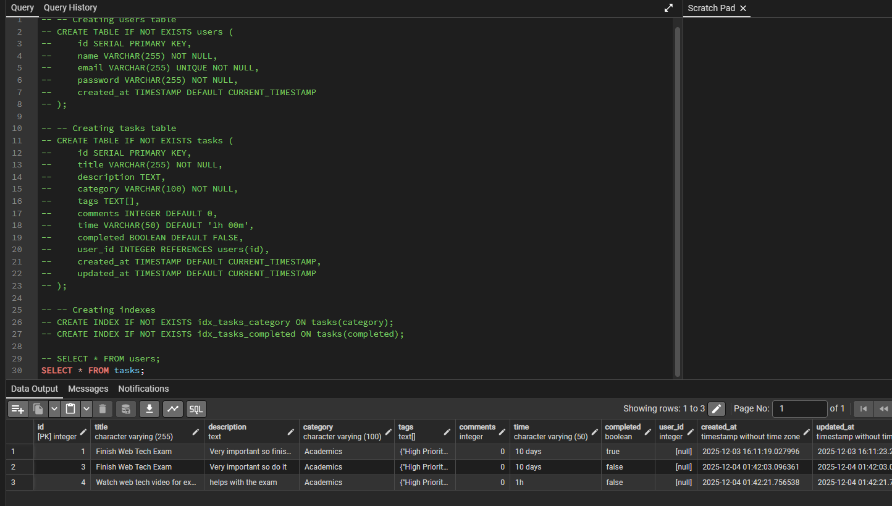
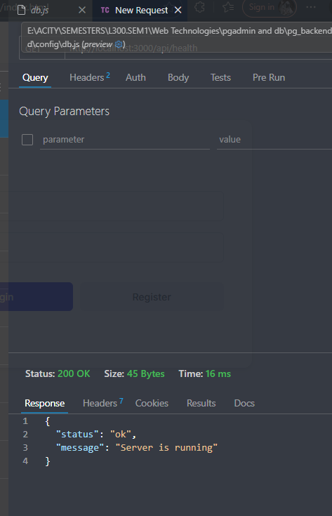

# CAMPUS TASK COLLABORATION BOARD
## Project Documentation

**Project Name:** Campus Task Collaboration Board  
**Developer:** Cyril Michael Dagher  
**Student ID:** 10012300026  
**Date:** December 2025

---

## TABLE OF CONTENTS

1. [Project Overview](#1-project-overview)
2. [What I Was Trying to Build](#2-what-i-was-trying-to-build)
3. [Features](#3-features)
4. [Tech Stack](#4-tech-stack)
5. [How It's Built (Architecture)](#5-how-its-built-architecture)
6. [Database Design](#6-database-design)
7. [API Documentation](#7-api-documentation)
8. [Frontend Code](#8-frontend-code)
9. [Backend Code](#9-backend-code)
10. [Security](#10-security)
11. [How to Set It Up](#11-how-to-set-it-up)
12. [How to Use It](#12-how-to-use-it)
13. [Testing](#13-testing)
14. [Problems I Ran Into](#14-problems-i-ran-into)
15. [Things I Want to Add Later](#15-things-i-want-to-add-later)
16. [Final Thoughts](#16-final-thoughts)

---

## 1. PROJECT OVERVIEW

So this is a task management web app I built for managing tasks around campus. It's basically a Kanban board (like Trello) where you can create tasks and organize them into different categories: Academics, Recreational, Sports, and Events.

The idea was to make something that students and staff could use to collaborate on tasks. It's pretty simple - you can create tasks, put them in categories, mark them as done, and delete them if you need to. The app also supports team collaboration where students can create teams, join teams using codes, assign tasks to team members, and track progress together.

This was my final exam project for my web technologies class.



*Figure 1: The deployed frontend showing the Tasks Board interface*

---

## 2. WHAT I WAS TRYING TO BUILD

My main goals were:

- Make a task management system that's easy to use
- Add user login/registration (with secure passwords and Student ID validation)
- Create a board interface where you can see all your tasks
- Let users organize tasks by category
- Track which tasks are done (with status: Pending, In Progress, Completed)
- Build a REST API for the backend
- Use PostgreSQL to store everything
- Add team collaboration features
- Allow task assignment to team members

I think I got most of these done, though some features are still basic.

---

## 3. FEATURES

### 3.1 Login/Registration

- You can register with your name, email, Student ID (8-12 digits), and password
- Email has to be unique (can't register twice with same email)
- Student ID must be 8-12 digits (validated on both frontend and backend)
- Passwords are hashed (not stored in plain text)
- Login works with email and password
- Once logged in, you stay logged in (using localStorage)


*Figure 2: User registration interface with Student ID validation*


*Figure 3: Login interface*

### 3.2 Task Management

- Create tasks with:
  - Title (required)
  - Description (optional)
  - Category (Academics, Recreational, Sports, or Events)
  - Status (Pending, In Progress, or Completed)
  - Assign To (optional - assign to team members)
  - Team (optional - link task to a team)
  - Tags (comma separated)
  - Time estimate (like "2h 30m")
- View all tasks in a board format (like Kanban)
- Mark tasks as completed (just check the box or change status)
- Delete tasks (with a confirmation popup)
- See all completed tasks in a separate section
- Change task status with a dropdown on each task card


*Figure 4: Creating a new task in the UI*


*Figure 5: Task created and displayed on the board with status management*


*Figure 6: Task data stored in PostgreSQL database*

### 3.3 Dashboard

- Overview page shows some stats about your tasks (total, completed, pending, in progress)
- Shows assigned tasks grouped by team member with status breakdowns
- Projects view is the main board (Kanban-style)
- Completed section shows all done tasks
- Teams section for creating and joining teams
- Milestones page (still working on this)
- Planning page (also still working on it)
- Profile dropdown to logout

### 3.4 Teams & Collaboration

- Create teams with name and description
- Join teams using a unique 6-character team code
- View all team members with their details
- See tasks assigned to each team member
- Team dashboard showing member statistics
- Leave teams (with admin transfer if needed)

### 3.5 UI Stuff

- Works on different screen sizes (tried to make it responsive)
- Simple, clean design
- Modal popups for creating/deleting tasks
- Navigation between different pages
- Updates when you make changes
- Custom styled notifications and confirmations (replaced browser alerts)

---

## 4. TECH STACK

### Frontend:
- **HTML5** - Basic structure
- **CSS3** - Styling (took me forever to get it right)
- **JavaScript** - All the logic
- **Fetch API** - To talk to the backend
- **LocalStorage** - Store some data on the client side

### Backend:
- **Node.js** - JavaScript on the server
- **Express.js** - Makes building APIs way easier
- **PostgreSQL** - Database
- **bcryptjs** - For hashing passwords
- **CORS** - so frontend can talk to backend
- **dotenv** - for environment variables

### Tools I Used:
- **Nodemon** - auto-restarts server (lifesaver during development)
- **Git** - Version control
- **Thunder Client** - Testing API endpoints (Postman works too)

### Database:
- **PostgreSQL** hosted on Render

### Deployment:
- **Frontend**: GitHub Pages
- **Backend**: Render (Node.js + PostgreSQL)


*Figure 7: Backend deployment on Render*


*Figure 8: Database schema and tables*


*Figure 9: Database tables after deployment*

---

## 5. HOW IT'S BUILT (ARCHITECTURE)

I built it in three layers:

### 5.1 Frontend (What Users See)

- **HTML files**: 
  - `index.html` for login/registration
  - `dashboard.html` for main page
- **CSS files**: 
  - `styles.css` for dashboard
  - `login.css` for login page
- **JavaScript files**:
  - `api.js` - Handles all API calls
  - `auth.js` - Login/registration logic
  - `tasks.js` - Task creation and management
  - `teams.js` - Team management
  - `dashboard.js` - Navigation and UI stuff
  - `notifications.js` - Custom modals for alerts/confirmations

### 5.2 Backend (Server)

- **Express.js server** (`server.js`)
- **API endpoints** for auth, tasks, teams, and users
- **Database connection** (`config/db.js`)
- **Route handlers** for all CRUD operations

### 5.3 Database

- **PostgreSQL**
- **Main tables**: users, tasks, teams, team_members

### How Data Flows:

1. User does something on the frontend (like create a task)
2. Frontend sends a request to the backend API
3. Backend processes it and talks to the database
4. Database sends data back
5. Backend sends JSON response to frontend
6. Frontend updates the UI

Pretty standard stuff, but it works!

---

## 6. DATABASE DESIGN

I have four main tables:

### 6.1 Users Table

- `id` - Auto-incrementing primary key
- `name` - User's name (required)
- `email` - User's email (required, must be unique)
- `student_id` - Student ID (8-12 digits, required, must be unique)
- `password` - Hashed password (required)
- `created_at` - When they registered

### 6.2 Tasks Table

- `id` - Auto-incrementing primary key
- `title` - Task title (required)
- `description` - Task description (optional)
- `category` - Which category it's in (required)
- `tags` - Array of tags (optional)
- `time` - Time estimate like "1h 00m" (defaults to "1h 00m")
- `status` - Task status enum: 'Pending', 'In Progress', 'Completed' (defaults to 'Pending')
- `comments` - Number of comments (defaults to 0, not really used yet)
- `user_id` - Which user created this task (foreign key to users table)
- `assignee_id` - Which user this task is assigned to (foreign key to users table, optional)
- `team_id` - Which team this task belongs to (foreign key to teams table, optional)
- `created_at` - When it was created
- `updated_at` - When it was last updated

### 6.3 Teams Table

- `id` - Auto-incrementing primary key
- `name` - Team name (required)
- `description` - Team description (optional)
- `creator_id` - User who created the team (foreign key to users table)
- `team_code` - Unique 6-character code for joining (required, unique)
- `created_at` - When it was created

### 6.4 Team Members Table

- `id` - Auto-incrementing primary key
- `team_id` - Which team (foreign key to teams table)
- `user_id` - Which user (foreign key to users table)
- `role` - Role enum: 'admin' or 'member' (defaults to 'member')
- `created_at` - When they joined

### Relationships:

- One user can have many tasks (one-to-many)
- One user can be in many teams (many-to-many via team_members)
- One team can have many members (one-to-many via team_members)
- Tasks are linked to users via `user_id` and `assignee_id`
- Tasks can be linked to teams via `team_id`

---

## 7. API DOCUMENTATION

**Base URL:** `http://localhost:3000/api`  
**Deployed URL:** `https://campus-task-collab-board-gqd5.onrender.com/api`

### 7.1 Authentication Endpoints

#### POST /api/auth/register
- Register a new user
- **Send:** `{ name, email, password, student_id }`
- **Returns:** `{ message, user }` on success
- **Errors:** 400 if email/student_id exists or fields missing, 500 for server errors

#### POST /api/auth/login
- Login
- **Send:** `{ email, password }`
- **Returns:** `{ token, user }` on success
- **Errors:** 401 if wrong credentials, 500 for server errors

### 7.2 Task Endpoints

#### GET /api/tasks?user_id={userId}
- Get all tasks for a user (tasks created by, assigned to, or in their teams)
- **Returns:** Array of tasks
- **Errors:** 400 if user_id missing, 500 for server errors

#### POST /api/tasks
- Create a new task
- **Send:** `{ title, description, category, tags, time, status, assignee_id, team_id, user_id }`
- **Returns:** The created task
- **Errors:** 400 if title/category/user_id missing, 500 for server errors

#### PUT /api/tasks/:id
- Update a task
- **Send:** Any fields you want to update (all optional)
- **Returns:** Updated task
- **Errors:** 404 if task not found, 500 for server errors

#### DELETE /api/tasks/:id
- Delete a task
- **Returns:** `{ message: "Task deleted" }`
- **Errors:** 404 if task not found, 500 for server errors

### 7.3 Team Endpoints

#### POST /api/teams
- Create a new team
- **Send:** `{ name, description, creator_id }`
- **Returns:** Created team with generated team_code
- **Errors:** 400 if name/creator_id missing, 500 for server errors

#### GET /api/teams
- Get all teams
- **Returns:** Array of all teams

#### GET /api/teams/:id
- Get team details with members
- **Returns:** Team object with members array (including task statistics)

#### POST /api/teams/join-by-code
- Join a team using team code
- **Send:** `{ team_code, user_id }`
- **Returns:** Team details and membership info
- **Errors:** 404 if team not found, 400 if already a member

#### DELETE /api/teams/:id/leave
- Leave a team
- **Send:** `{ user_id }` in body
- **Returns:** Success message
- **Errors:** 404 if not a member

#### GET /api/users/:id/teams
- Get all teams a user is part of
- **Returns:** Array of teams with user's role

#### GET /api/teams/:id/members
- Get all members of a team
- **Returns:** Array of team members

### 7.4 User Endpoints

#### GET /api/users
- Get all users (for task assignment dropdowns)
- **Returns:** Array of users

### 7.5 Health Check

#### GET /api/health
- Check if server is running
- **Returns:** `{ status: "ok", message: "Server is running" }`


*Figure 10: API health check endpoint test*

---

## 8. FRONTEND CODE

The frontend is organized into several JavaScript modules:

### 8.1 api.js
- Handles all API calls to the backend
- Automatically detects local vs deployed environment
- Includes error handling and JSON parsing
- Functions for auth, tasks, teams, and users

### 8.2 auth.js
- Manages login and registration
- Validates Student ID format (8-12 digits)
- Stores user data in localStorage
- Redirects to dashboard on successful login

### 8.3 tasks.js
- Task creation and management
- Renders tasks on the Kanban board
- Handles task status updates
- Manages task deletion
- Loads users and teams for assignment dropdowns

### 8.4 teams.js
- Team creation and joining
- Displays team lists and details
- Shows team members with task statistics
- Handles leaving teams
- Team code copying functionality

### 8.5 dashboard.js
- Main navigation logic
- View switching (Start, Projects, Planning)
- Overview statistics
- Assigned tasks by member
- User dropdown menu
- Search functionality

### 8.6 notifications.js
- Custom notification modals (replaces browser alerts)
- Custom confirmation modals (replaces browser confirms)
- Styled to match the app theme

---

## 9. BACKEND CODE

### 9.1 server.js
Main Express server with all route handlers:
- Authentication routes (register, login)
- Task CRUD operations
- Team management routes
- User routes
- Error handling and validation

### 9.2 config/db.js
Database connection configuration:
- Detects local vs remote database
- Configures SSL for remote connections
- Connection pooling for performance
- Error handling

---

## 10. SECURITY

### 10.1 Passwords
- Hashed with bcryptjs (10 salt rounds) before storing
- Never stored in plain text

### 10.2 Authentication
- Token stored in localStorage (basic implementation)
- Protected routes (though not fully implemented yet)
- Session management

### 10.3 Input Validation
- Server checks all inputs
- Required fields validated
- Email format checked
- Student ID format validated (8-12 digits)
- SQL injection prevented with parameterized queries

### 10.4 Database
- Connection pooling
- SSL for external database
- Foreign key constraints for data integrity

---

## 11. HOW TO SET IT UP

### 11.1 What You Need
- Node.js (v14 or higher)
- npm
- PostgreSQL (local or use Render's free database)
- A browser

### 11.2 Backend Setup

1. Go to backend folder:
   ```bash
   cd backend
   ```

2. Install dependencies:
   ```bash
   npm install
   ```

3. Set up database connection in `config/db.js`:
   - Update the connection string with your PostgreSQL info

4. Create the tables:
   Run the SQL setup script or use pgAdmin/PostgreSQL terminal to create:
   - users table
   - tasks table
   - teams table
   - team_members table

5. Start the server:
   ```bash
   npm run dev
   ```
   Server runs on http://localhost:3000

### 11.3 Frontend Setup

1. Use a local server (I use Live Server extension in VS Code)
2. Make sure backend is running first!
3. Open `index.html` (root) or `frontend/index.html` in browser

**Note:** The live version uses GitHub Pages for frontend and Render for backend, so you don't need to set this up if you just want to use the app.

### 11.4 Environment Variables (Optional)

Create `.env` file in backend folder:
```
PORT=3000
DATABASE_URL=your_database_connection_string
```

---

## 12. HOW TO USE IT

### 12.1 Register
1. Open the app
2. Fill in name, email, Student ID (8-12 digits), and password
3. Click Register
4. Then you can login

### 12.2 Login
1. Enter email and password
2. Click Login
3. Goes to dashboard

### 12.3 Create a Task
1. Go to "Projects" in the nav
2. Click "+" button or "+ Add a Task" in any column
3. Fill in the form:
   - Title (required)
   - Description (optional)
   - Status (Pending, In Progress, or Completed)
   - Assign To (optional - select a team member)
   - Team (optional - link to a team)
   - Time estimate (optional)
   - Tags (comma separated, optional)
4. Click "Add Task"

### 12.4 Manage Tasks
- **Change Status**: Use the status dropdown on any task card
- **Complete**: Just check the checkbox (automatically sets to Completed)
- **View Completed**: Go to the Completed section
- **Delete**: Click the three dots (⋯) and confirm
- **Assign Tasks**: Select an assignee when creating or editing tasks

### 12.5 Create or Join a Team
1. Go to "Teams" in the sub-navigation
2. **To Create**: Click "+ Create Team", enter name and description, then create
3. **To Join**: Click "Join Team", enter the 6-character team code, then join
4. View team details to see all members, their task statistics, and copy the team code

### 12.6 Navigation
- **Start**: Welcome page with feature overview
- **Projects**: Main task board (kanban by category)
- **Overview**: Task stats and assigned tasks by team member
- **Teams**: View and manage your teams
- **Completed**: Done tasks
- **Milestones**: Milestone stuff (coming soon)
- **Planning**: Planning section with tips (also coming soon)

### 12.7 Profile
- Click avatar in top right (shows first letter of your name)
- See user info
- Click Logout to sign out

Pretty straightforward!

---

## 13. TESTING

### 13.1 What I Tested

**Authentication:**
- Register with valid data ✓
- Register with duplicate email (shows error) ✓
- Register with invalid Student ID (shows error) ✓
- Login with correct credentials ✓
- Login with wrong password (shows error) ✓
- Empty fields validation ✓

**Tasks:**
- Create tasks in different categories ✓
- View tasks on board ✓
- Mark tasks as completed ✓
- Change task status ✓
- Assign tasks to team members ✓
- Delete tasks ✓
- Tasks persist after refresh ✓
- View completed tasks ✓

**Teams:**
- Create teams ✓
- Join teams with code ✓
- View team members ✓
- See member task statistics ✓
- Leave teams ✓

**UI:**
- Navigation works ✓
- Modals open/close ✓
- Responsive design (mostly works) ✓
- Error messages show up ✓
- Loading states (basic) ✓

### 13.2 API Testing

I used Thunder Client (Postman works too) to test:
- POST /api/auth/register ✓
- POST /api/auth/login ✓
- GET /api/tasks ✓
- POST /api/tasks ✓
- PUT /api/tasks/:id ✓
- DELETE /api/tasks/:id ✓
- POST /api/teams ✓
- GET /api/teams/:id ✓
- POST /api/teams/join-by-code ✓
- GET /api/health ✓

Tested with:
- Valid requests ✓
- Invalid requests (error handling) ✓
- Missing fields ✓
- Auth headers (where needed) ✓

Everything seems to work, though there might be edge cases I haven't found yet!

---

## 14. PROBLEMS I RAN INTO

### 14.1 Database Connection
**Problem:** Had trouble connecting to Render's PostgreSQL database at first

**Solution:** Had to configure SSL settings and make sure the connection string was in the right format. Also implemented automatic detection of local vs remote connections. Took me a while to figure out!

### 14.2 Password Hashing
**Problem:** Needed to hash passwords securely

**Solution:** Used bcryptjs with 10 salt rounds. Learned about this in class, so it wasn't too hard once I knew what to use.

### 14.3 Frontend-Backend Communication
**Problem:** Getting frontend to talk to backend was confusing at first

**Solution:** Created api.js to centralize all API calls. Made it way easier to manage and debug. Also added automatic URL detection for local vs deployed.

### 14.4 Task State Management
**Problem:** Keeping track of tasks across different views was messy

**Solution:** Made centralized functions for fetching and rendering tasks. Still not perfect, but it works.

### 14.5 Modal Issues
**Problem:** Add task button wasn't opening the modal

**Solution:** Fixed event delegation and async/await issues. Had to expose some functions globally so different modules could access them.

### 14.6 Delete Confirmation
**Problem:** Browser's confirm() dialog looked ugly

**Solution:** Made my own custom modal for delete confirmation. Looks way better and matches the design.

### 14.7 CORS Issues
**Problem:** Frontend couldn't call backend API (CORS errors)

**Solution:** Added CORS middleware to Express. Took me a bit to figure out the right configuration.

### 14.8 Route Ordering
**Problem:** `/api/teams/join-by-code` was returning 404 because Express was matching it to `/api/teams/:id/join`

**Solution:** Moved the specific route before the parameterized route. Express matches routes in order, so specific routes need to come first.

### 14.9 Task Filtering
**Problem:** All users were seeing all tasks, regardless of who created them

**Solution:** Added `user_id` to tasks table and implemented filtering on the backend to only show tasks created by, assigned to, or in teams the user is part of.

### 14.10 Team Functionality
**Problem:** Teams weren't loading or creating properly

**Solution:** Created comprehensive database setup script and improved error messages. Also fixed database table creation order.

There were more small issues, but these were the main ones. Google and Stack Overflow were my best friends during this project!

---

## 15. THINGS I WANT TO ADD LATER

### 15.1 Authentication
- [ ] Proper JWT tokens (right now it's just a placeholder)
- [ ] Token refresh
- [ ] Password reset
- [ ] Email verification

### 15.2 Task Features
- [x] Assign tasks to specific users ✓
- [x] Task status management (Pending, In Progress, Completed) ✓
- [ ] Due dates and reminders
- [ ] Task priorities
- [ ] File uploads
- [ ] Comments on tasks (the field exists but UI not built yet)
- [ ] Search and filter
- [ ] Drag and drop to reorder tasks

### 15.3 User Features
- [x] User profiles with avatars (shows first letter of name) ✓
- [ ] User roles
- [x] Teams/organizations ✓
- [ ] Activity logs
- [ ] Notifications

### 15.4 UI/UX
- [ ] Keyboard shortcuts
- [ ] Dark mode
- [ ] Mobile app
- [ ] Real-time updates with WebSockets

### 15.5 Technical Stuff
- [ ] Unit tests
- [ ] Integration tests
- [ ] API rate limiting
- [ ] Caching
- [ ] Database indexing (some already done)
- [ ] Error logging
- [ ] Better deployment setup

Lots of ideas, but I'll add them when I have time!

---

## 16. FINAL THOUGHTS

This project was a lot of work, but I learned so much building it. I got better at:

- Frontend development (HTML, CSS, JavaScript)
- Backend development (Node.js, Express)
- Database design and PostgreSQL
- Building REST APIs
- Authentication and security basics
- UI/UX design
- Team collaboration features
- Task management systems

The app works pretty well for what it is. It's not perfect, but I'm happy with how it turned out. The architecture is simple enough that I can add features later if I want.

### What I'm Proud Of:
- Got authentication working (with password hashing!)
- Kanban board actually works
- Can create, update, delete tasks
- Team collaboration features work
- Task assignment and status management
- UI looks decent
- API works and handles errors
- Database integration works
- Deployed successfully to Render and GitHub Pages

### What Could Be Better:
- JWT tokens (using placeholder for now)
- More features (milestones, planning sections are empty)
- Better error handling in some places
- More testing
- Better responsive design
- Real-time updates

Overall, I think this project shows I can build a full-stack web application. It was challenging but fun, and I'm glad I got it done!

---

This was my final exam for my web technologies class, and I'm pretty happy with how it turned out. Hope you like it!

---

## APPENDIX: SCREENSHOTS

### Deployment Screenshots


*Deployed frontend on GitHub Pages showing the Tasks Board*


*Backend deployment on Render*


*Database schema showing all tables*


*Database tables after deployment*

### Testing Screenshots


*User registration interface with Student ID validation*


*Login interface*


*Creating a new task*


*Task displayed on board with status management*


*Task data stored in PostgreSQL*


*API health check endpoint test*

---

**END OF DOCUMENTATION**

---

**Project by:** Cyril Michael Dagher  
**Student ID:** 10012300026  
**Date:** December 2025

